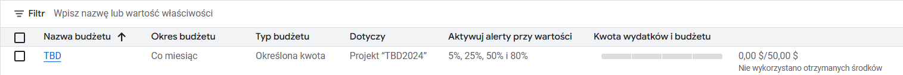

IMPORTANT ❗ ❗ ❗ Please remember to destroy all the resources after each work session. You can recreate infrastructure by creating new PR and merging it to master.
  

1. Authors:

   Z5
   * Ada Sawilska 300466
   * Amelia Tabor 300466

   https://github.com/AdaSawilska/tbd-workshop-1
   
3. Follow all steps in README.md.

4. Select your project and set budget alerts on 5%, 25%, 50%, 80% of 50$ (in cloud console -> billing -> budget & alerts -> create buget; unclick discounts and promotions&others while creating budget).

 

  

5. From avaialble Github Actions select and run destroy on main branch.

   
   
7. Create new git branch and:
    1. Modify tasks-phase1.md file.
    
    2. Create PR from this branch to **YOUR** master and merge it to make new release. 
    
  

8. Analyze terraform code. Play with terraform plan, terraform graph to investigate different modules.

    

   
   
10. Reach YARN UI
   
   gcloud compute ssh tbd-cluster-m --project=tbd-2024l-300466 --zone=europe-west1-d --tunnel-through-iap -- -L 8088:localhost:8088
   
   
11. Draw an architecture diagram (e.g. in draw.io) that includes:
    1. VPC topology with service assignment to subnets
    2. Description of the components of service accounts
    3. List of buckets for disposal
    4. Description of network communication (ports, why it is necessary to specify the host for the driver) of Apache Spark running from Vertex AI Workbech
  
    ***place your diagram here***

12. Create a new PR and add costs by entering the expected consumption into Infracost
For all the resources of type: `google_artifact_registry`, `google_storage_bucket`, `google_service_networking_connection`
create a sample usage profiles and add it to the Infracost task in CI/CD pipeline. Usage file [example](https://github.com/infracost/infracost/blob/master/infracost-usage-example.yml) 

   ***place the expected consumption you entered here***

   ***place the screenshot from infracost output here***

11. Create a BigQuery dataset and an external table using SQL
    
    
   
    ***why does ORC not require a table schema?***
    ORC (Optimized Row Columnar) is a self-describing file format, meaning it inherently contains the metadata about its schema, such as column names, data types, and structure, embedded within the file itself. This eliminates the need to explicitly define the schema when creating external tables in BigQuery or other systems that support ORC.

  
13. Start an interactive session from Vertex AI workbench:
  gcloud compute --project "tbd-2024l-300466" ssh --zone "europe-west1-b" "tbd-2024l-300466-notebook" -- -L 8080:localhost:8080
     
   
14. Find and correct the error in spark-job.py

    ***describe the cause and how to find the error***

15. Additional tasks using Terraform:

    1. Add support for arbitrary machine types and worker nodes for a Dataproc cluster and JupyterLab instance

    ***place the link to the modified file and inserted terraform code***
    
    3. Add support for preemptible/spot instances in a Dataproc cluster

    ***place the link to the modified file and inserted terraform code***
    
    3. Perform additional hardening of Jupyterlab environment, i.e. disable sudo access and enable secure boot
    
    ***place the link to the modified file and inserted terraform code***

    4. (Optional) Get access to Apache Spark WebUI

    ***place the link to the modified file and inserted terraform code***
